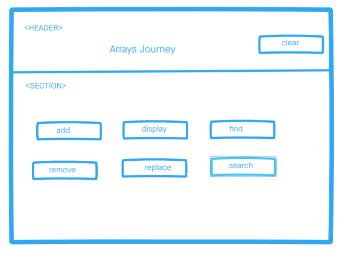

# Development Strategy

> `Testing project week 2`

## favorite-words

A basic web page aim to learn JavaScript, testing and developed collaboratively using branches.

## Wireframe

## 0. Set-Up

_A User can see my initial repository and live demo_

> Assigned to Mamé

### Repository

- Created a new repository from this [template](https://github.com/HackYourFutureBelgium/favorite-words)
- Clone the repository
- Write initial, basic README
- Add a wireframe
- Start the development strategy
- Prepare a project board
- Push the changes to GitHub
- Turn on GitHub Pages

## 1. Style Main Page

**As a site visitor, I want to see a fancy website.**

> assigned to Mamé

### Repo

This user story has been developed through a branch called 'style'.

### HTML

- add header and section semantic tags
- add bootstrap links and font family links
- use bootstrap grid

### CSS

- add background img
- style buttons

### javascript

-Nothing has changed

## 2.find a specific word

**As a site visitor, I want to see a my name in the database whether exist or not.**

> assigned to Mamé

### Repo

This user story has been developed through a branch called 'find'.

### HTML

- Nothing has changed

### CSS

- Nothing has changed

### javascript

-Used find method to word

## 3. Add word

**As a site visitor, I want to add a word by clicking on _Add_ button**

> assigned to Miroslav

### Repo

This user story has been developed on a branch called 'add'.

### HTML

- Nothing has changed

### CSS

- Nothing has changed

### JavaScript

- Complete _addWordHandler_ function

## 4. Remove a specific word

**As a site visitor, I want to be able to remove a specific word that i entered.**

> assigned to Eltayeb

### Repo

This user story has been developed through a branch called 'remove'.

### HTML

No html markup has been added on this user story.

### CSS

No styling has been added.

### javascript

- Write the removeHandler function logic.
- Verify if the removeHandler work correctly.

## 5. Replace a Specific Word

**As a site visitor, I want to have the possibility to replace a specific word by clicking on _Replace a Specific Word_ button**

> assigned to Miroslav

### Repo

This user story has been developed on a branch called 'replace'.

### HTML

- Nothing has changed

### CSS

- Nothing has changed

### JavaScript

- Complete _replaceHandler_ function

## 7.Search a specific word

**As a site visitor, I want to search for a specific word.**

> assigned to Murielle

### Repo

This user story has been developed through a branch called 'Search'.

### HTML

- Nothing has changed

### CSS

- Nothing has changed

### javascript

- complete search handler
